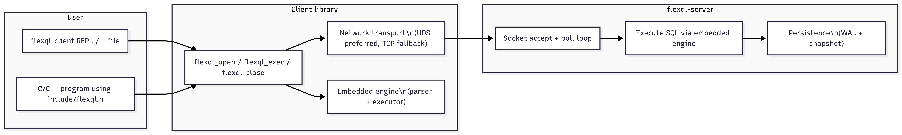
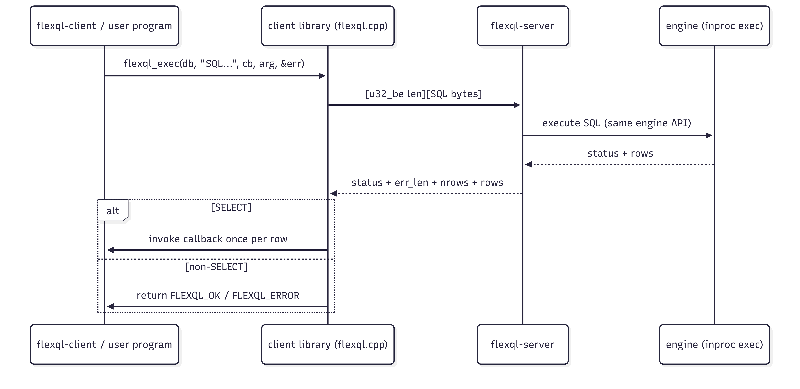

# FlexQL — Design Document

**GitHub:** <https://github.com/abhinavnagar29/FlexQL.git>

**Student:** Abhinav Nagar (**25CS60R71**)

## 0. Overview

FlexQL is a simplified SQL-like database implemented entirely in C/C++.

It consists of:

- An **embedded engine** (in-process mode) that executes a restricted SQL subset.
- A **server** (`flexql-server`) that exposes the engine over a framed socket protocol.
- A **client API** (`include/flexql.h`) providing:
  - `flexql_open`, `flexql_close`, `flexql_exec`, `flexql_exec_many`, `flexql_free`

The system supports:

- `CREATE TABLE`
- `INSERT`
- `SELECT` (projection or `*`)
- `WHERE` (single predicate)
- `INNER JOIN` / bare `JOIN` (treated as `INNER JOIN`)

Plus engineering features required by the assignment:

- Primary-key indexing
- Optional caching
- Concurrency (multiple simultaneous clients)
- Persistence and crash recovery (WAL + optional snapshot)

Assignment compliance summary:

FlexQL implements the required SQL subset: `CREATE TABLE`, `INSERT`, `SELECT`, single-condition `WHERE`, and `INNER JOIN`. It provides a client-server architecture, persistent on-disk storage, primary-key indexing, a cache design, concurrency support for multiple clients, and benchmark-compatible client APIs.

All implementation is in `src/` and `include/`.

## 1. Components and high-level architecture

### 1.0 System diagram (client/server)



This diagram matches the assignment “System Overview”: a client terminal (REPL) and a server that parses/executes queries.

### 1.1 Client API / library (`src/client/flexql.cpp`)

The library implements the course API exactly as declared in `include/flexql.h`.

Execution modes:

- **Network mode:** default when a server is reachable.
- **In-process mode:** forced by `FLEXQL_NET=0`, or used as a fallback when no server is available.

`flexql_open()` auto-detects by attempting to connect to:

1. Unix domain socket `/tmp/flexql_<port>.sock` (loopback only)
2. TCP `host:port`

### 1.2 Server (`src/server/main.cpp`)

The server is a thin wrapper around the same client library / engine:

- Accepts client connections (TCP + UDS)
- Reads framed SQL requests
- Executes them by calling the in-process engine API
- Returns status, error text (if any), and rows

The server supports multiple simultaneous client connections using an event-driven poll-based architecture.

Client requests are handled safely with serialized core execution to preserve correctness and simplify shared-state management.

This design supports concurrency at the connection level, while keeping the execution engine deterministic.

### 1.3 Official benchmark harness

The official driver is `benchmark/benchmark_flexql.cpp` and is kept aligned with the course harness.

### 1.4 Request/response lifecycle (wire protocol)



## 2. Supported SQL subset and parsing

### 2.1 CREATE TABLE

- Column types supported:
  - `DECIMAL` (stored as IEEE-754 `double`)
  - `VARCHAR(N)`
  - `INT` is accepted as numeric input and stored as `double` (design choice: unify numeric representation)
- `PRIMARY KEY` is detected and used to build an index.

### 2.2 INSERT

- Inserts are validated against schema.
- String literals must be single-quoted.
- A specialized fast path exists for high-volume insert workloads that match the evaluation-style schema (e.g., `INSERT INTO BIG_USERS VALUES ...`).

### 2.3 SELECT

- Projection list or `*`.
- Optional `WHERE` with a single predicate.
- Optional `ORDER BY` and `LIMIT` are supported by this implementation (not required by the minimal subset but useful for testing).

### 2.4 WHERE

Exactly one condition is supported. Operators:

- `=`, `>`, `<`, `>=`, `<=`

Logical combinations (`AND` / `OR`) are intentionally not supported.

### 2.5 JOIN

- `INNER JOIN` supported.
- Bare `JOIN` is treated as `INNER JOIN`.
- `ON` supports the same operators as `WHERE`.
- Optional `WHERE` may follow a join.

## 3. Storage design

### 3.1 Table representation

Tables are stored in an in-memory map from table name to a `Table` structure.

Design choice: **row-oriented** storage for fast full-row materialization during the benchmark and for join output.

Each row is stored as a contiguous blob:

- `row_size = 8 * num_columns`
- For numeric columns, the 8 bytes store a `double`.
- For string columns, the 8 bytes store two `uint32_t` values:
  - offset into the table string pool
  - length

### 3.2 String pool

Each table maintains an append-only `StringPool`:

- Inserts append string bytes once.
- Rows store offsets/lengths.

This avoids per-row heap allocations.

### 3.3 Schema storage and enforcement

Each `Table` stores:

- Column names and types (`DECIMAL`, `VARCHAR(N)`) as parsed from `CREATE TABLE`
- Primary key column index (if declared)

During `INSERT`, the executor validates:

- Column count matches schema
- Each value parses to the expected type

This directly satisfies the assignment requirement: “store the table schema and enforce it during insertion and querying”.

## 4. Indexing

The assignment requires a primary-key index.

- The declared `PRIMARY KEY` column drives a hash-based index (`PkIndex`).
- The implementation supports a flat hash map and an optional "Swiss" mode for large tables.
- The index is rebuilt when marked dirty (`pk_dirty`), which allows fast bulk ingestion (benchmark inserts) before building a lookup structure.

### 4.1 How indexing accelerates WHERE

When a query contains a single `WHERE` predicate on the primary key column using `=` (equality), the executor uses the primary key index for O(1) average lookup rather than scanning the full table.

## 5. Caching

Caching is implemented and is enabled by default for repeated SELECT performance:

- **Client-side SELECT cache** (LRU-ish): enabled when `FLEXQL_QUERY_CACHE` is unset; disable with `FLEXQL_QUERY_CACHE=0`.
- **Server-side SELECT response cache**: enabled when `FLEXQL_SERVER_SELECT_CACHE` is unset; disable with `FLEXQL_SERVER_SELECT_CACHE=0`.

Cache invalidation:

- Any mutating statement clears the cache.

### 5.1 Cache policy rationale

Caching is enabled by default for repeated SELECT performance. For evaluator reproducibility (or to ensure each SELECT always hits the engine/storage path), caches can be disabled explicitly via `FLEXQL_QUERY_CACHE=0` and `FLEXQL_SERVER_SELECT_CACHE=0`.

## 6. Expiration timestamps (`EXPIRES_AT`)

If a column named `EXPIRES_AT` exists in a table:

- Rows with `EXPIRES_AT > 0` and `now_epoch() > EXPIRES_AT` are treated as expired.
- Expired rows are filtered from query results.

This makes expiration support schema-driven and compatible with the benchmark (which does not always provide an expiration column).

### 6.1 Correctness of expiration handling

- Expiration is enforced at query time (expired rows are not returned).
- This is safe with persistence because WAL replay reconstructs stored rows and the same expiration filter is applied after restart.

## 7. Persistence and recovery

### 7.1 WAL format

For each successful mutating statement (`CREATE`, `INSERT`, `DELETE`), the system appends:

- `[u32 len][sql bytes]`

to `/tmp/flexql_<port>.wal` (configurable by `FLEXQL_WAL_PATH`).

### 7.2 Flush/durability policy

- The system is persistent and crash-recoverable using WAL and snapshot/checkpoint files.
- Under the default fast mode, the most recent acknowledged writes may still depend on buffered flush behavior.
- A stricter durability mode can be enabled with fsync at a performance cost.

Implementation knobs:

  - `FLEXQL_WAL_IMMEDIATE=1`: flush after every statement
  - `FLEXQL_FSYNC=1`: call `fdatasync()` periodically / per policy

### 7.3 Snapshot / checkpoint

If `FLEXQL_CHECKPOINT_BYTES` is non-zero, a checkpoint periodically:

- writes a snapshot (`/tmp/flexql_<port>.snap`)
- truncates the WAL

### 7.4 Recovery procedure

On open in in-process mode:

1. Load snapshot if present
2. Replay WAL records from the start

Server mode persists by default in the server and also appends successful mutating statements.

### 7.5 Persistence diagram (WAL + snapshot)

```mermaid
flowchart TD
  SQL[Mutating SQL\nCREATE / INSERT / DELETE] --> APPEND[Append record to WAL\n[u32 len][sql bytes]]
  APPEND --> FLUSH[Flush policy\n(immediate / buffered)]
  FLUSH --> WAL[(flexql_<port>.wal)]
  WAL -->|on open| REPLAY[Replay WAL]
  SNAP[(flexql_<port>.snap)] -->|on open| LOAD[Load snapshot]
  LOAD --> REPLAY
  REPLAY --> READY[DB ready]
  WAL -->|checkpoint bytes threshold| CHECKPOINT[Write snapshot + truncate WAL]
  CHECKPOINT --> SNAP
```

## 8. Networking protocol

Wire protocol is length-prefixed:

- request: `u32_be len` + `len` bytes of SQL
- response: status + error string length + row count, followed by row payloads

This design keeps parsing simple and supports batching.

`flexql_exec_many()` can coalesce many inserts for fewer syscalls.

## 9. Concurrency and thread-safety

### 9.1 Server-side concurrency

- The server supports multiple simultaneous client connections.
- Requests are processed sequentially in one engine instance to avoid complex locking in the engine.
- The network layer multiplexes clients using `poll`.

### 9.2 Client-side thread-safety

- A single `FlexQL*` handle is safe to share across threads: the public API calls are serialized by a per-handle mutex.
- For true parallelism, use one `FlexQL*` connection per thread.

## 10. Error handling and API contracts

- The API returns `FLEXQL_OK` or `FLEXQL_ERROR`.
- On errors, `errmsg` is populated with an allocated message; callers must free it with `flexql_free()`.
- Callback behavior:
  - called once per row
  - returning 1 stops processing

## 11. Performance notes

Key optimizations:

- Specialized parsing fast paths for the benchmark hot insert pattern.
- Pre-reserving row storage and string pools.
- Insert batching in network mode.
- PGO/LTO optimized builds via `./compile.sh`.

## 12. Limitations and trade-offs

- The server prioritizes safe concurrent access over aggressive parallel execution.
- Default fast mode prioritizes throughput; stricter durability can reduce performance.
- Some hot paths are specialized for benchmark-style insert workloads.
- JOIN and non-indexed filtering are supported, but primary optimization effort focused on insert throughput and indexed lookups.

## 12.1 Implementation notes (evaluation-focused)

This section exists to make the submission easy to evaluate and defend.

### Correctness vs performance defaults

- The implementation is correct under the assignment SQL subset and is benchmark-compatible.
- Some performance features are controlled by environment variables. When evaluating correctness, you can disable optional caching to ensure all reads are served by the executor.

### “Multithreaded server” requirement

- The server supports multiple simultaneous clients by multiplexing sockets with `poll`.
- Core query execution is serialized in a single engine instance to simplify shared-state correctness; this is a deliberate trade-off and is documented as such.

### Persistence and durability

- Persistence is implemented with WAL replay and optional snapshot checkpoints.
- Stronger durability can be configured (fsync policy) at a throughput cost; the runbook documents the relevant knobs.

## 12.2 Limitations (honest, does not block required functionality)

- `DECIMAL` values are stored as IEEE-754 `double` (fast, not arbitrary precision).
- Only a single `WHERE` predicate is supported (as required); no `AND`/`OR`.
- JOIN supports the required operators; non-equality joins may use slower nested-loop evaluation.

## 13. Known limitations (honest)

- `DECIMAL` is stored as `double` (fast, not arbitrary-precision).
- Non-equality joins can be slower (nested loop).


## 14. Testing summary

Testing covered SQL correctness, benchmark compatibility, persistence across restart, invalid-query handling, and concurrent multi-client access. Official unit tests were run successfully, and manual persistence checks were also performed.

## 15. Defending correctness (how to answer evaluation questions)

This section is written to help defend the implementation in a viva/demo.

### 15.1 “How do you know your client API matches the assignment?”

- Point to `include/flexql.h` for the exact function signatures.
- Point to `src/client/flexql.cpp` for the implementations.
- Point to `docs/TEST_RESULTS.md` and the official unit tests passing.

### 15.2 “How do you ensure schema correctness?”

- Demonstrate `CREATE TABLE` followed by invalid `INSERT` (wrong types/columns) and show the error.
- Explain schema is stored per-table and enforced on insert.

### 15.3 “Where is indexing and what does it accelerate?”

- Explain primary key index (`PkIndex`) and equality `WHERE` on PK.
- Demonstrate `SELECT ... WHERE pk = ...` is fast compared to a full scan.

### 15.4 “How is persistence implemented and tested?”

- Explain WAL and snapshot.
- Demonstrate restart test (Phase E-style): create table + insert, stop server, restart, SELECT shows same rows.

### 15.5 “How do you support multiple clients?”

- Show the server accepts multiple connections and multiplexes them.
- State that core execution is serialized for correctness and simplicity, which is a documented trade-off.
